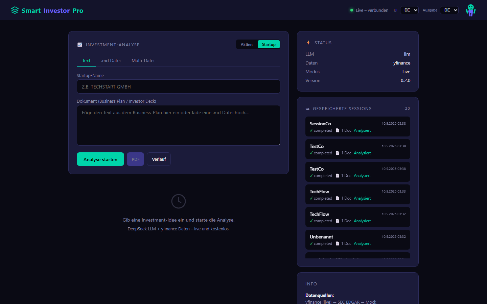
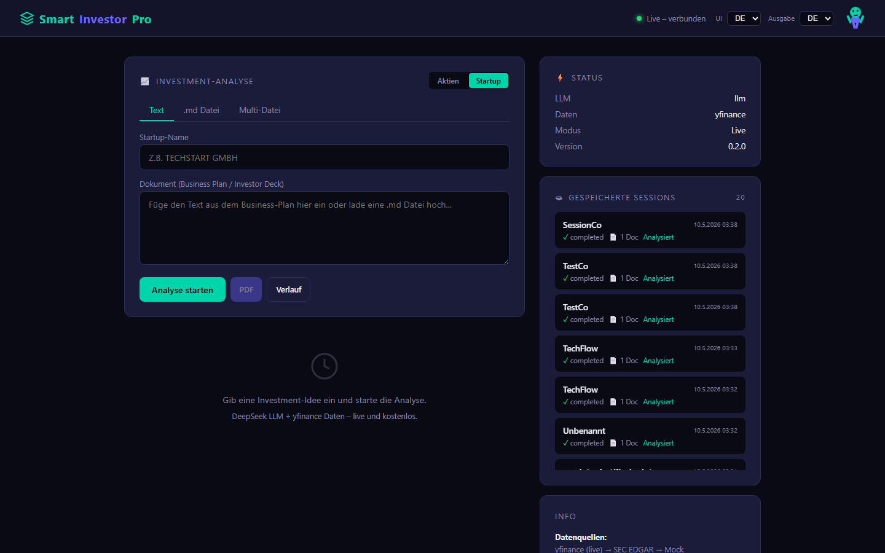
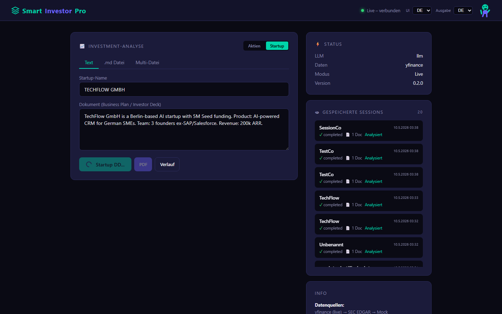
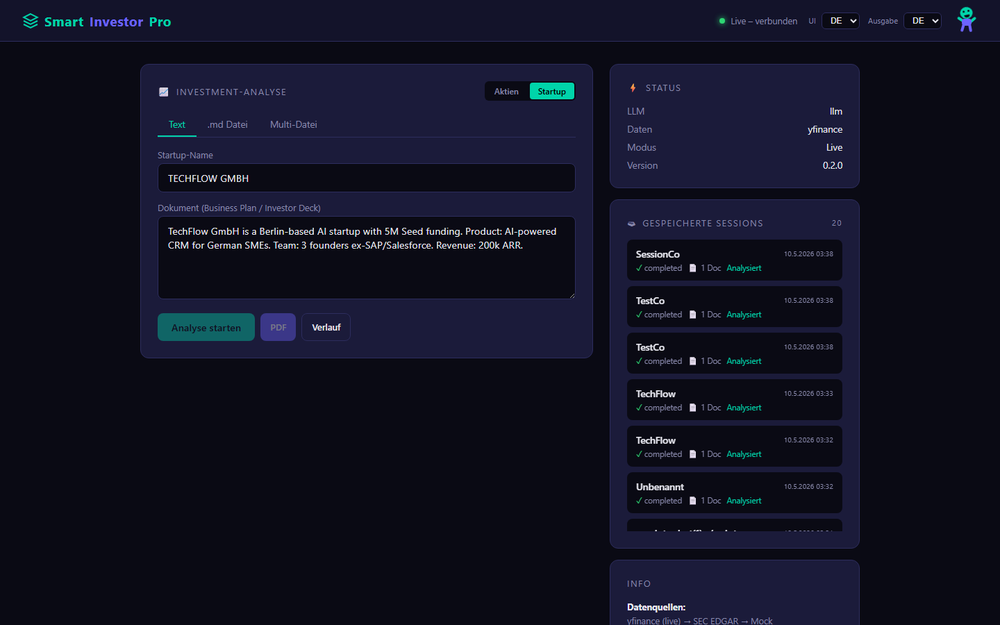
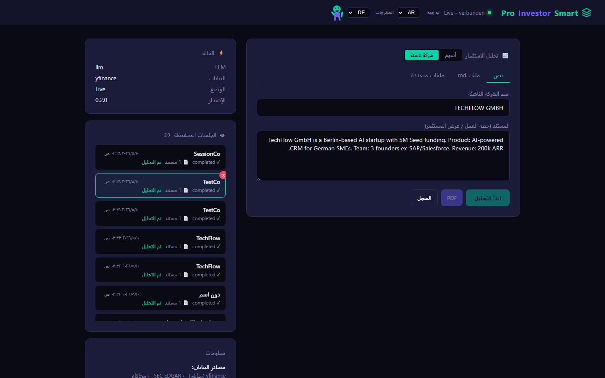
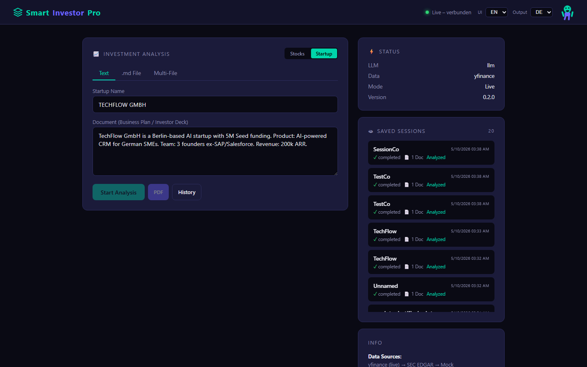
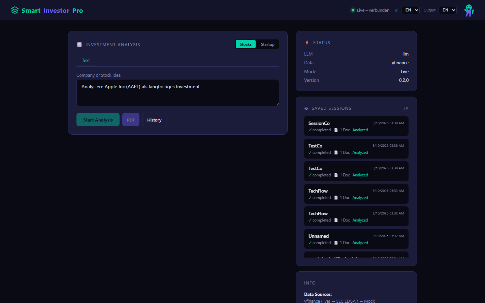

<p align="center">
  
</p>

<h1 align="center">🚀 Smart Investor Pro</h1>

<p align="center">
  <strong>AI-Powered Due Diligence & Investment Analysis Platform</strong><br>
  <em>Equity Analysis · Startup DD · Multi-LLM · Multilingual (DE/EN/FR/AR/TR)</em>
</p>

<p align="center">
  
  
  
  
  
</p>

---

## 📋 Table of Contents

- [EN – English](#english)
- [DE – Deutsch](#deutsch)
- [AR – العربية](#arabic)

---

<a name="english"></a>

## 🇬🇧 English — Overview

**Smart Investor Pro** is a full-stack investment analysis platform that performs AI-powered due diligence for both **public equities** and **private startups** — in one unified dashboard.

### ✨ Features

| Feature | Description |
|---------|-------------|
| **🔹 Equity Analysis** | Analyze any publicly traded company by ticker. Gets live market data (P/E, D/E, revenue growth, market cap) and generates a structured InvestmentMemo with risk assessment, competitive analysis, and recommendation. |
| **🔹 Startup DD** | Paste a business plan or upload `.md` files for AI-powered venture capital due diligence. Calculates scorecards, radar charts, unit economics, and projections. Supports multi-file sessions. |
| **🔹 Multi-LLM Engine** | Runs **DeepSeek** and **Gemini 2.0 Flash** in parallel. Combines results via weighted consensus scoring with agreement checks. Automatic fallback if one provider fails. |
| **🔹 PDF Reports** | Generates professional 9-section PDF reports for both equities and startups. MiFID II compliant. |
| **🔹 Multilingual UI** | Full i18n support: **Deutsch · English · Français · العربية · Türkçe**. UI language and output language are independently selectable. |
| **🔹 Session Management** | Sessions persist to disk (`data/sessions/*.json`). Upload multiple documents, run analysis, and come back later. |
| **🔹 Audit Trail** | Immutable audit chain with SHA-256 hashing for compliance tracking. |
| **🔹 Security** | JWT authentication, rate limiting (20 req/min), input sanitization against prompt injection, file upload validation. |

### 🖼️ Screenshots

| View | Screenshot |
|------|-----------|
| **Dashboard Start** – Mode selector, equity input |  |
| **Startup Mode** – Paste business plan |  |
| **Startup Analysis Result** – Investment memo with risks, strengths, scorecard |  |
| **German UI** – Full German interface |  |
| **Arabic UI** – Full Arabic interface (RTL) |  |
| **UI=English, Output=German** – Independent language selection |  |
| **Equity Mode** – Stock analysis with ticker |  |

### 🧠 How It Works

```
User Input ──► Frontend (Dashboard)
                   │
        ┌──────────┼──────────┐
        ▼          ▼          ▼
   Equity       Startup    Session
   Analysis     DD         Manager
        │          │          │
        ▼          ▼          │
   ┌────────────────────┐     │
   │  Multi-LLM Router  │◄────┘
   │  (DeepSeek/Gemini) │
   └────────┬───────────┘
            ▼
   ┌────────────────┐
   │  Parser +      │
   │  Compliance    │
   └────────┬───────┘
            ▼
   ┌──────────────────────────┐
   │  PDF Report / Dashboard  │
   │  Display / Audit Log     │
   └──────────────────────────┘
```

### 🏗️ Architecture

```
smart-investor-mvp/
├── main.py                     # FastAPI app entrypoint
├── agents.py                   # InvestmentAgent orchestrator
├── models.py                   # Pydantic schemas (InvestmentMemo, RiskAssessment)
├── compliance.py               # Audit chain, input sanitization, market data
├── reports.py                  # PDF generation (ReportLab)
├── llm_router.py               # LLM routing (deprecated → startup_dd/router.py)
├── dashboard.html              # Full single-page application UI
├── config/                     # Environment-aware settings
├── locales/                    # i18n: de.json, en.json, fr.json, ar.json, tr.json
├── data/
│   └── json_parser.py          # JSON recovery & field remapping
├── startup_dd/
│   ├── startup_schema.py       # Startup-specific Pydantic models
│   ├── startup_agent.py        # Startup analysis orchestrator
│   ├── router.py               # MultiLLMRouter (parallel execution)
│   ├── consensus.py            # Weighted consensus scoring
│   ├── vc_prompt.py            # VC system prompts (5 languages)
│   ├── document_parser.py      # Regex metric extraction
│   ├── evaluator.py            # Weighted startup scoring
│   ├── visuals.py              # Scorecard/radar/unit economics
│   ├── dashboard_html.py       # HTML dashboard generator
│   ├── cache.py                # Redis/in-memory cache
│   ├── session_store.py        # Session persistence
│   └── reports.py              # Startup PDF generation
└── tests/
    ├── test_api.py             # API endpoint tests (11)
    ├── test_security.py        # Security tests (JWT, injection, CORS) (56)
    └── test_v04.py             # Visual/consensus tests (5)
```

### 🚀 Quick Start

```bash
# Clone & enter
git clone https://github.com/zagrallo/smart-investor-pro.git
cd smart-investor-mvp

# Install dependencies
pip install -r requirements.txt

# Configure API keys (.env)
# DEEPSEEK_API_KEY=sk-...
# GEMINI_API_KEY=...
# (optional) LLM_API_KEY=...  # fallback

# Run
uvicorn main:app --host 0.0.0.0 --port 8000

# Open
# http://localhost:8000
```

### 🧪 Tests

```bash
# All tests
pytest tests/ --ignore=tests/load_test.py

# Individual suites
pytest tests/test_api.py -v         # 11 endpoint tests
pytest tests/test_security.py -v    # 56 security tests
pytest tests/test_v04.py -v         # 5 visual/consensus tests
```

**Results: 71/71 tests passing** ✅

### 🔧 Tech Stack

| Layer | Technology |
|-------|-----------|
| **Backend** | Python 3.14+, FastAPI, Uvicorn |
| **LLM** | DeepSeek V3 + Gemini 2.0 Flash (parallel) |
| **Frontend** | Vanilla JS, CSS custom properties, i18n |
| **PDF** | ReportLab |
| **Auth** | JWT (python-jose), HTTPBearer |
| **Database** | SQLite (via aiosqlite for audit) |
| **Session** | JSON file store (`data/sessions/`) |
| **Cache** | Redis (optional, in-memory fallback) |

---

<a name="deutsch"></a>

## 🇩🇪 Deutsch — Überblick

**Smart Investor Pro** ist eine Full-Stack-Plattform für KI-gestützte Investment-Analysen — sowohl für **börsennotierte Aktien** als auch für **private Startups** — in einem einheitlichen Dashboard.

### ✨ Funktionen

| Funktion | Beschreibung |
|----------|-------------|
| **🔹 Aktienanalyse** | Analysiere jedes börsennotierte Unternehmen per Ticker. Live-Marktdaten (KGV, VK, Umsatzwachstum, Marktkap.) + strukturiertes InvestmentMemo mit Risikobewertung, Wettbewerbsanalyse und Empfehlung. |
| **🔹 Startup DD** | Businessplan einfügen oder `.md`-Dateien hochladen für KI-gestützte Venture-Capital-Due-Diligence. Scorecard, Radar-Chart, Unit Economics und Projektionen. |
| **🔹 Multi-LLM Engine** | **DeepSeek** und **Gemini 2.0 Flash** parallel. Ergebnisse via Weighted-Consensus-Scoring kombiniert. Automatischer Fallback bei Ausfall. |
| **🔹 PDF-Reports** | Professionelle 9-seitige PDF-Reports für Aktien und Startups. MiFID II-konform. |
| **🔹 Mehrsprachig** | Vollständige i18n: **Deutsch · English · Français · العربية · Türkçe**. UI- und Ausgabesprache unabhängig wählbar. |
| **🔹 Session-Management** | Sessions persistent auf Disk (`data/sessions/*.json`). Mehrere Dokumente hochladen, analysieren, später fortsetzen. |
| **🔹 Audit-Trail** | Unveränderliche Audit-Kette mit SHA-256-Hashing für Compliance. |
| **🔹 Sicherheit** | JWT-Authentifizierung, Rate-Limiting (20 Anfragen/min), Input-Sanitisierung gegen Prompt-Injection, Datei-Validierung. |

### 🖼️ Screenshots

| Ansicht | Screenshot |
|---------|-----------|
| **Dashboard Start** – Modusauswahl, Aktieneingabe |  |
| **Startup-Modus** – Businessplan einfügen |  |
| **Analyse-Ergebnis** – Memo mit Risiken, Stärken, Scorecard |  |
| **Deutsches UI** – Komplette deutsche Oberfläche |  |
| **Arabisches UI** – Komplette arabische Oberfläche (RTL) |  |
| **UI=Englisch, Ausgabe=Deutsch** – Getrennte Sprachwahl |  |
| **Aktien-Modus** – Aktienanalyse mit Ticker |  |

### 🚀 Schnellstart

```bash
git clone https://github.com/zagrallo/smart-investor-pro.git
cd smart-investor-mvp
pip install -r requirements.txt

# .env anlegen mit: DEEPSEEK_API_KEY=... und/oder GEMINI_API_KEY=...
uvicorn main:app --host 0.0.0.0 --port 8000
# http://localhost:8000
```

### 🧪 Tests

```bash
pytest tests/ --ignore=tests/load_test.py   # 71 Tests, alle ✅
```

---

<a name="arabic"></a>

## 🇸🇦 العربية — نظرة عامة

**Smart Investor Pro** هو منصة متكاملة للتحليل الاستثماري المدعوم بالذكاء الاصطناعي، تُجري العناية الواجبة لكل من **الأسهم العامة** و**الشركات الناشئة الخاصة** — في لوحة تحكم موحدة.

### ✨ الميزات

| الميزة | الوصف |
|--------|-------|
| **🔹 تحليل الأسهم** | حلّل أي شركة مدرجة في البورصة باستخدام رمزها. يحصل على بيانات السوق الحية (مضاعف الربحية، نسبة الدين إلى الحقوق الملكية، نمو الإيرادات، القيمة السوقية) وينتج مذكرة استثمارية منظمة مع تقييم المخاطر وتحليل المنافسة والتوصية. |
| **🔹 العناية الواجبة للشركات الناشئة** | الصق خطة العمل أو حمّل ملفات `.md` للعناية الواجبة الاستثمارية المدعومة بالذكاء الاصطناعي. يحسب بطاقات الأداء والرسوم البيانية الرادارية واقتصاديات الوحدة والتوقعات المالية. |
| **🔹 محرك LLM متعدد** | يشغّل **DeepSeek** و **Gemini 2.0 Flash** بالتوازي. يدمج النتائج عبر التسجيل التوافقي الموزون مع فحوصات التوافق. احتياطي تلقائي إذا تعطل أحد المزوّدين. |
| **🔹 تقارير PDF** | يولّد تقارير PDF احترافية من 9 أقسام للأسهم والشركات الناشئة. متوافقة مع معايير MiFID II. |
| **🔹 واجهة متعددة اللغات** | دعم كامل للتدويل: **Deutsch · English · Français · العربية · Türkçe**. لغة الواجهة ولغة المخرجات قابلتان للاختيار بشكل مستقل. |
| **🔹 إدارة الجلسات** | الجلسات محفوظة على القرص (`data/sessions/*.json`). حمّل مستندات متعددة، حلّل، وعد لاحقاً. |
| **🔹 سجل التدقيق** | سلسلة تدقيق غير قابلة للتغيير بتشفير SHA-256 للامتثال التنظيمي. |
| **🔹 الأمان** | مصادقة JWT، تحديد المعدل (20 طلب/دقيقة)، تنقية المدخلات ضد حقن الأوامر، التحقق من صحة الملفات المرفوعة. |

### 🖼️ لقطات الشاشة

| المنظر | لقطة الشاشة |
|--------|------------|
| **شاشة البداية** – اختيار الوضع، إدخال الأسهم |  |
| **وضع الشركة الناشئة** – لصق خطة العمل |  |
| **نتيجة التحليل** – المذكرة مع المخاطر ونقاط القوة وبطاقة الأداء |  |
| **الواجهة الألمانية** – واجهة كاملة بالألمانية |  |
| **الواجهة العربية** – واجهة كاملة بالعربية (من اليمين لليسار) |  |
| **الواجهة=إنجليزية، المخرجات=ألمانية** – اختيار لغة مستقل |  |
| **وضع الأسهم** – تحليل الأسهم برمز التداول |  |

### 🚀 بداية سريعة

```bash
git clone https://github.com/zagrallo/smart-investor-pro.git
cd smart-investor-mvp
pip install -r requirements.txt

# أنشئ ملف .env بـ: DEEPSEEK_API_KEY=... و/أو GEMINI_API_KEY=...
uvicorn main:app --host 0.0.0.0 --port 8000
# http://localhost:8000
```

### 🧪 الاختبارات

```bash
pytest tests/ --ignore=tests/load_test.py   # 71 اختباراً، جميعها ناجحة ✅
```

---

## 📄 License

MIT

## 🙏 Acknowledgements

- [DeepSeek](https://deepseek.com/) for LLM API
- [Google Gemini](https://deepmind.google/gemini/) for LLM API
- [ReportLab](https://www.reportlab.com/) for PDF generation
- [FastAPI](https://fastapi.tiangolo.com/) for the backend framework
